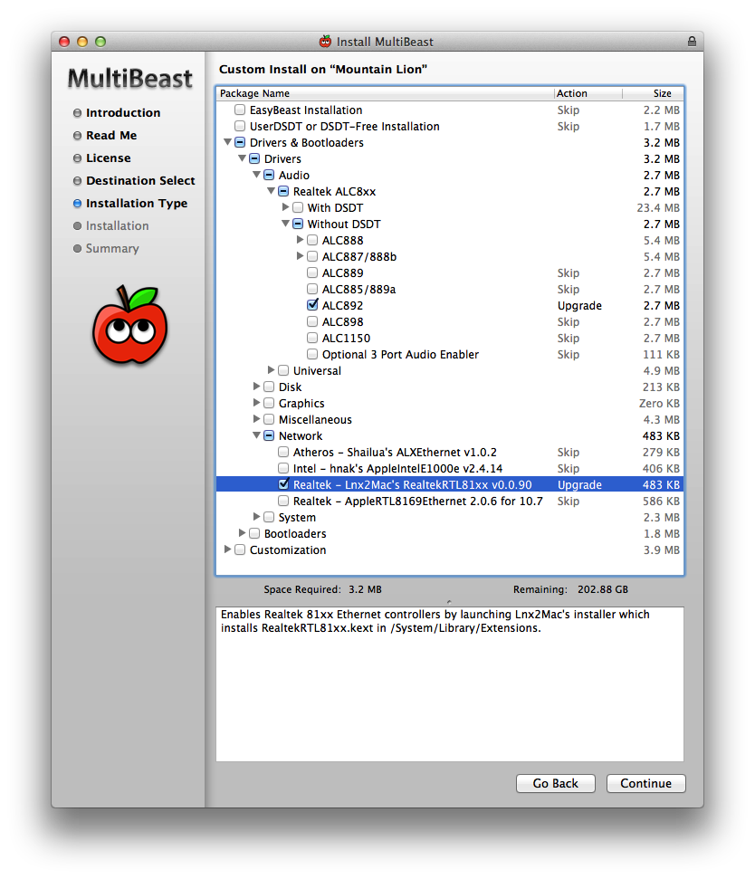

##Hackintosh Based On Mesheven PC

###The way to get here

We spend much of the part-time start installing hackintosh from zero, we met many
problems and bugs, restarted pc many many times, but all solved through searching
and learning from Internet.

Really happy to share it with you!

###About

This is project about how to install [hackintosh](http://en.wikipedia.org/wiki/Hackintosh)(黑苹果) painless on mesheven pc.

The motherboard is [Gigabyte H77N Wifi](http://www.gigabyte.com.au/products/product-page.aspx?pid=4338#ov), thanks Steve.
So if your pc also use the motherboard, the guide also can help.

###How to install

#### Install Mountain Lion (10.8)

Basically we can follow the tutorial from [tonymacx86.com](http://www.tonymacx86.com/61-unibeast-install-os-x-mountain-lion-any-supported-intel-based-pc.html)
to install the mac os X 10.8 (mountain lion)

###Bugs fix

Although install successfully, but hackintosh still exist some bugs need to fix, mostly of
them are from Device Drivers.

Below I will list some of the bugs have been fixed:

* **Sometimes can't connect the internet**

<del>At first, we solve this issue use the stupid way by restarting the system again and again.
Several times later, It gone ok.

<del>But now, we find the way to solve:

<del>`sudo ifconfig en0 ether 90:2b:34:de:19:e4`

<del>`sudo ifconfig en0 down`

<del>`sudo ifconfig en0 up`

<del>`en0` is the first network card, so `en1` is the second card.

<del>`90:2b:34:de:19:e4` is the mac address of the network card you used.(Mesheven pc has two network cards)

<del>`down`, `up` is restarting the network card.

现在，一直插了两根网线，一直未出现断网

* **Audio device can't found** (10.9.3没有此问题)

Can't control the system voice & can't find the audio device. But USB headphone works.

So we should reinstall driver self:

    cd ./10.8/Audio/
    mv AppleHDA.kext HDAEnabler1.kext ~/Desktop/
    Doublclick [KextBeast](http://tonymacx86.blogspot.com/2010/08/kextbeast-simple-kext-installer.html) to install (It will move the two files to /System/Library/Extensions/ folder)
    reboot
    
#### Install Mavericks (10.9.3)

1. 制作U盘启动盘（10.9.3的系统一定要在App Store里下载，其他第三方网盘或迅雷下载的在用Unibeast制作U盘启动盘时都会报错：系统不完整）
2. 启动电脑进入U盘系统，如果进不去`-x`进安全模式，格式化U盘（注意options分区选项，选择可启动分区）
3. 系统安装完成后，启动进到系统盘中（进不去同样`-x`进安全模式），用MulitBeast安装各种驱动，可在坛子里提前找好DSDT文件。需要特别选择的是声卡 和 网卡 驱动
4. 最后需要特别添加一个启动选项`dart=0`，可以将这项配置添加到`/Extra/org.chameleon.Boot.plist`文件中：

		<key>Kernel Flags</key>
		<string>dart=0</string>

###Notes:

2.  **Don't Install NEED RESTART UPDATES from App Store**
4.  **Don't use [cleanmymac](http://macpaw.com/cleanmymac) or similar software, sometimes it will delete some system related files make hackintosh crash**

###Tips:

Above are based on Mesheven PC (Gigabyte H77N Wifi motherboard), please notice. Other
PC or motherboard I can't guarantee this guide works.
